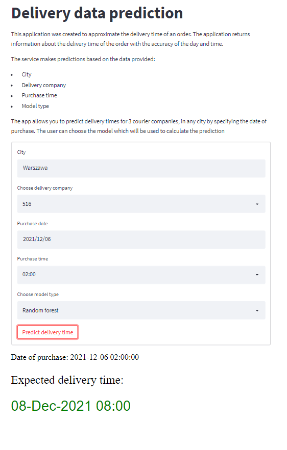

# Streamlit app

Aplikacja ma na celu przewidzieć czas dostawy przesyłki na podsatwie czasu zakupu, miasta oraz firmy kurierskiej. Użytkownik ma możliwość wyboru modelu z jakiego będzie korzystał.

Aby uruchomić aplikacje należy przejść do folderu *service* a następnie uruchomić główny program
```
streamlit run streamlit.py
``` 


